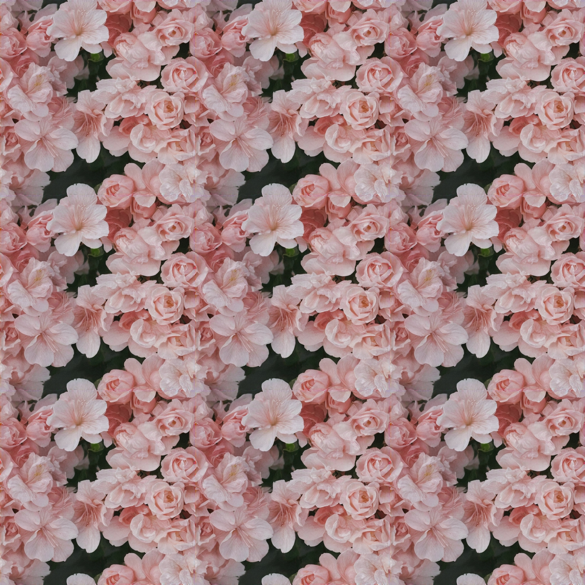

It change UNetModel and VAE Conv2d Layer into circular padding mode that make any text2image process generate seamless patten

```python
model = model.clone()
for layer in model.model.diffusion_model.modules():
    if (isinstance(layer, nn.Conv2d)):
        layer.padding_mode = 'circular'

patcher = vae.patcher.clone()
for layer in patcher.model.modules():
    if (isinstance(layer, nn.Conv2d)):
        layer.padding_mode = 'circular'
vae.patcher = patcher
vae.first_stage_model = patcher.model
```

<div class="image-container">
    
    
</div>

<!-- <!DOCTYPE html>
<html>
    <head>
        <style>
            .image-container {
                display: flex; 
                justify-content: center;
                align-items: center;
                flex-wrap: wrap; 
                margin: 0px; 
            }
            .image-container img {
                flex: 1; 
                width: calc(33.333% - 20px);
                border: none; 
                object-fit: cover;
            }
        </style>
    </head>
    <body>
        <div class="image-container">
            
            
        </div>
        <div class="image-container">
            
            
        </div>
    </body>
</html> -->
